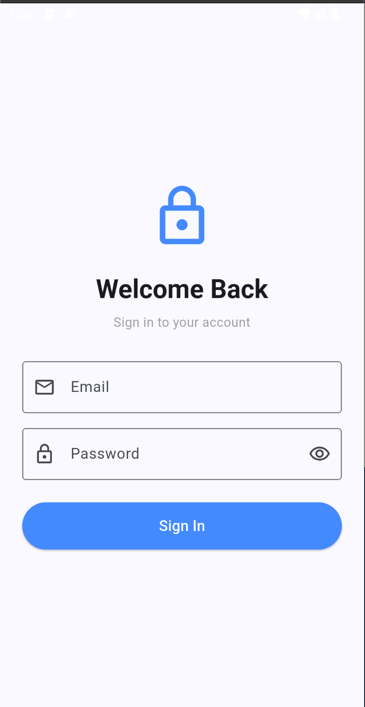
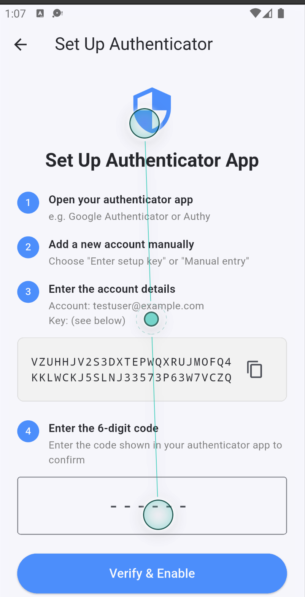
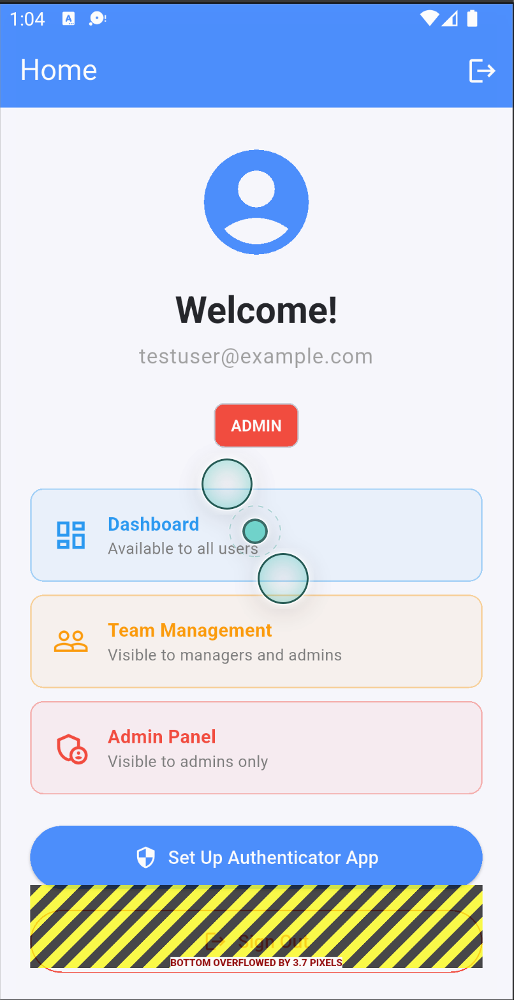
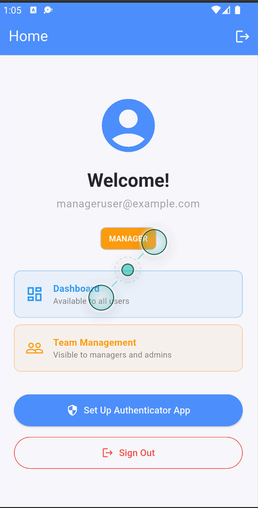
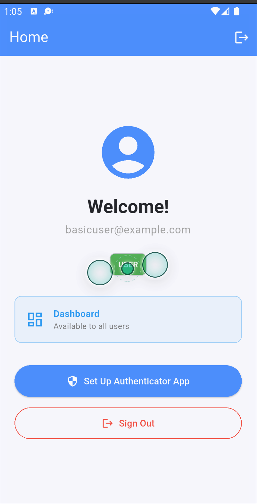

# Flutter Auth with AWS Cognito

A Flutter application demonstrating enterprise-grade authentication using AWS Cognito — featuring MFA (SMS & TOTP) and Role-Based Access Control (RBAC) via Cognito Groups.

---

## Screenshots

### Sign In
<p align="center">
  
</p>

### TOTP Setup (QR Code)
<p align="center">
  
</p>

### Role-Based Home Screens

<p align="center">
  
  &nbsp;&nbsp;&nbsp;
  
  &nbsp;&nbsp;&nbsp;
  
</p>
<p align="center">
  <b>Admin</b>
  &nbsp;&nbsp;&nbsp;&nbsp;&nbsp;&nbsp;&nbsp;&nbsp;&nbsp;&nbsp;&nbsp;&nbsp;&nbsp;&nbsp;&nbsp;&nbsp;&nbsp;&nbsp;&nbsp;&nbsp;&nbsp;&nbsp;&nbsp;&nbsp;&nbsp;&nbsp;&nbsp;&nbsp;
  <b>Manager</b>
  &nbsp;&nbsp;&nbsp;&nbsp;&nbsp;&nbsp;&nbsp;&nbsp;&nbsp;&nbsp;&nbsp;&nbsp;&nbsp;&nbsp;&nbsp;&nbsp;&nbsp;&nbsp;&nbsp;&nbsp;&nbsp;&nbsp;&nbsp;&nbsp;&nbsp;&nbsp;&nbsp;&nbsp;
  <b>User</b>
</p>

---

## What's Working

| Feature | Status |
|---|---|
| Email + password sign-in (USER_SRP_AUTH) | ✅ |
| MFA routing — SMS challenge after sign-in | ✅ |
| MFA routing — TOTP challenge after sign-in | ✅ |
| TOTP setup via QR code scan | ✅ |
| Session persistence — stays signed in on relaunch | ✅ |
| Auth gate — auto-routes to Home or Login on startup | ✅ |
| RBAC — role badge from Cognito Groups | ✅ |
| RBAC — role-gated UI sections per role | ✅ |
| Sign out | ✅ |

---

## Roles & Test Credentials

Three Cognito Groups are configured: `admin`, `manager`, and `user`.

| Role | Email | Password | Visible Sections |
|---|---|---|---|
| **Admin** | `testuser@example.com` | `Test@1234` | Dashboard + Team Management + Admin Panel |
| **Manager** | `manageruser@example.com` | `Test@1234` | Dashboard + Team Management |
| **User** | `basicuser@example.com` | `Test@1234` | Dashboard only |

> Role information is read directly from the Cognito ID token (`cognito:groups` claim) — no extra API call required.

---

## Tech Stack

| Layer | Technology |
|---|---|
| Framework | Flutter 3.x |
| Auth Provider | AWS Cognito (User Pool) |
| Amplify SDK | `amplify_flutter` ^2.6.1 |
| Auth Plugin | `amplify_auth_cognito` ^2.6.1 |
| QR Code | `qr_flutter` ^4.1.0 |
| Auth Flow | USER_SRP_AUTH (password never sent in plaintext) |
| MFA | OPTIONAL — SMS + TOTP |

---

## Project Structure

```
lib/
├── main.dart                     # Amplify init + AuthGate (routes on session state)
├── amplifyconfiguration.dart     # Cognito config — gitignored, see .template file
├── services/
│   └── auth_service.dart         # signIn, confirmMfa, setUpTotp, verifyTotpSetup,
│                                 # signOut, getCurrentUser, isSignedIn, getUserGroups
└── screens/
    ├── login_screen.dart         # Email + password form
    ├── mfa_screen.dart           # SMS and TOTP code entry (post sign-in)
    ├── totp_setup_screen.dart    # QR code display + verification
    └── home_screen.dart          # Role badge + role-gated content + sign out
```

---

## Auth Flow

```
App Start
  └─ AuthGate
       ├─ Session active  ──────────────────────────────► HomeScreen
       └─ No session      ──► LoginScreen
                                  └─ signIn()
                                       ├─ SMS MFA    ──► MfaScreen(sms)  ──┐
                                       ├─ TOTP MFA   ──► MfaScreen(totp) ──┼──► HomeScreen
                                       └─ No MFA     ───────────────────►──┘
```

---

## Setup

### 1. Clone the repo

```bash
git clone https://github.com/mahesh-maney/FlutterAuthWithCognito.git
cd FlutterAuthWithCognito
```

### 2. Configure Amplify

Copy the template and fill in your Cognito values:

```bash
cp lib/amplifyconfiguration.dart.template lib/amplifyconfiguration.dart
```

Edit `lib/amplifyconfiguration.dart`:

```dart
"PoolId":      "YOUR_USER_POOL_ID",    // e.g. ap-south-2_xxxxxxx
"AppClientId": "YOUR_APP_CLIENT_ID",   // from Cognito App Client (no secret)
"Region":      "YOUR_REGION"           // e.g. ap-south-2
```

### 3. Install dependencies & run

```bash
flutter pub get
flutter run
```

---

## AWS Cognito Setup (CLI)

Recreate the User Pool from scratch using the AWS CLI:

```bash
# 1. Create User Pool
aws cognito-idp create-user-pool \
  --pool-name "FlutterAuthTestPool" \
  --username-attributes email \
  --mfa-configuration OPTIONAL

# 2. Enable TOTP + SMS MFA
aws cognito-idp set-user-pool-mfa-config \
  --user-pool-id YOUR_POOL_ID \
  --mfa-configuration OPTIONAL \
  --software-token-mfa-configuration Enabled=true

# 3. Create App Client (no secret)
aws cognito-idp create-user-pool-client \
  --user-pool-id YOUR_POOL_ID \
  --client-name FlutterAuthClient \
  --no-generate-secret \
  --explicit-auth-flows ALLOW_USER_SRP_AUTH ALLOW_REFRESH_TOKEN_AUTH

# 4. Create RBAC groups
aws cognito-idp create-group --user-pool-id YOUR_POOL_ID --group-name admin
aws cognito-idp create-group --user-pool-id YOUR_POOL_ID --group-name manager
aws cognito-idp create-group --user-pool-id YOUR_POOL_ID --group-name user

# 5. Create a user, set password, assign to group
aws cognito-idp admin-create-user \
  --user-pool-id YOUR_POOL_ID \
  --username user@example.com \
  --user-attributes Name=email,Value=user@example.com Name=email_verified,Value=true \
  --message-action SUPPRESS

aws cognito-idp admin-set-user-password \
  --user-pool-id YOUR_POOL_ID \
  --username user@example.com \
  --password "YourPassword1" \
  --permanent

aws cognito-idp admin-add-user-to-group \
  --user-pool-id YOUR_POOL_ID \
  --username user@example.com \
  --group-name admin
```

---

## How RBAC Works

When a user signs in, Cognito embeds their group memberships in the **ID token JWT**:

```json
{
  "cognito:groups": ["admin"],
  "email": "testuser@example.com"
}
```

The app reads this with no extra network call — role is available instantly from the token:

```dart
final session = await Amplify.Auth.fetchAuthSession() as CognitoAuthSession;
final groups = session.userPoolTokensResult.value.idToken.groups;
// e.g. ["admin"]
```

The UI then conditionally renders sections based on group membership:

```
admin   → Dashboard + Team Management + Admin Panel
manager → Dashboard + Team Management
user    → Dashboard only
```

---

## Adding Screenshots

Save screenshots into a `screenshots/` folder at the project root and push:

```
screenshots/
├── login_screen.png
├── totp_setup.png
├── home_admin.png
├── home_manager.png
└── home_user.png
```

---

## License

MIT
